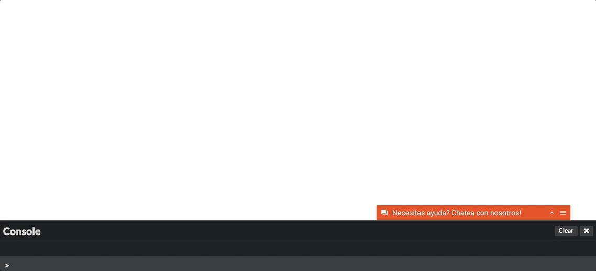
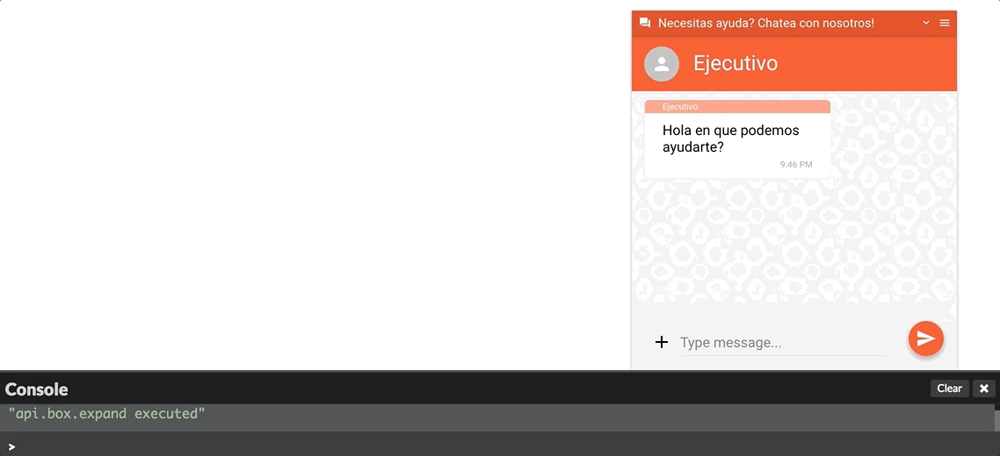

# Chat Box Eventos de Comportamiento

Usando el método **window.$LT.on** es posible es posible registrar funciones que son invocadas cuando diferentes eventos del box ocurre. Por ejemplo: Cuando se expande, se minimiza, se oculta o se muestra:

## api.box.show


```javascript
  messenger.on('api.box.show', function(api.box.show) {
    // Haz algo asombroso cuando este evento suceda
    console.info('api.box.show executed');
  });
```

## api.box.hide

Este evento se dispara cuando el widget se oculta. Este evento puede ocurrir por ejemplo cuando se invoca al método **[window.$LT.setDisplayState('minimized')](publicapi#windowltsetdisplaystatestring)

```javascript
  messenger.on('api.box.hide', function(api.box.hide) {
    // Haz algo asombroso cuando este evento suceda
    console.info('api.box.hide executed');
  });
```

## api.box.expand

Este evento se dispara cuando el widget se expande. Este evento puede ocurrir cuando el usuario hace click en el widget estando este en el estado minimizado o cuando se invoca al método **[window.$LT.setDisplayState('small')](publicapi#windowltsetdisplaystatestring)



```javascript
  messenger.on('api.box.expand', function() {
    // Haz algo asombroso cuando este evento suceda
    console.info('api.box.expand executed');
  });
```

## api.box.minimize

Este evento se dispara cuando el widget se minimize. Este evento puede ocurrir cuando el usuario hace click en el widget estando este en el estado expandido o cuando se invoca al método **[window.$LT.setDisplayState('minimized')](publicapi#windowltsetdisplaystatestring)



```javascript
  messenger.on('api.box.minimize', function() {
    // Haz algo asombroso cuando este evento suceda
    console.info('api.box.minimize executed');
  });
```
