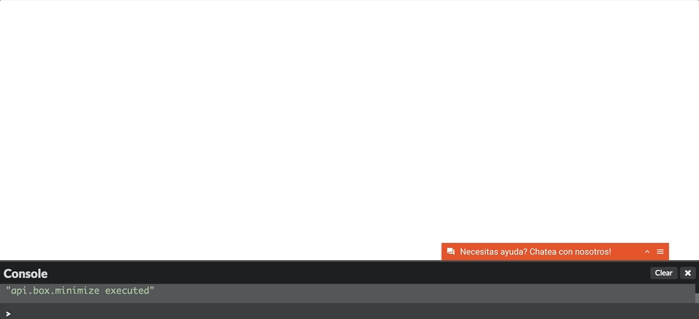
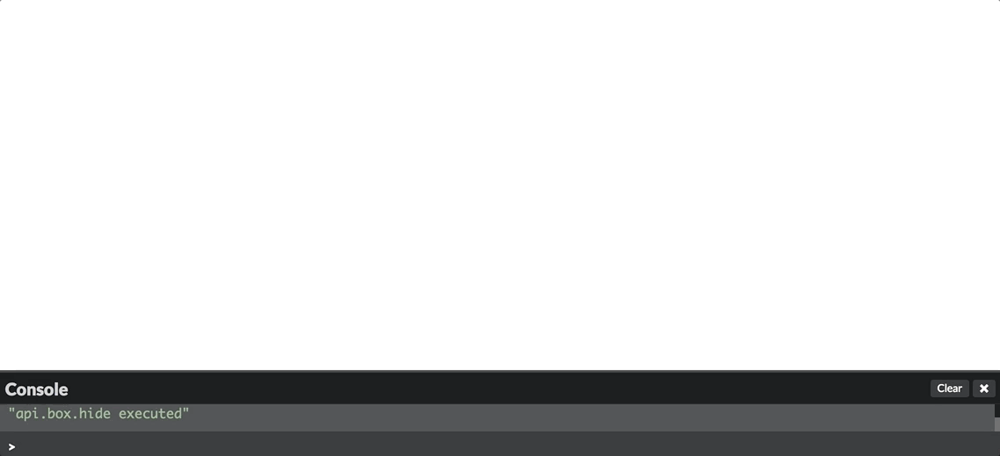
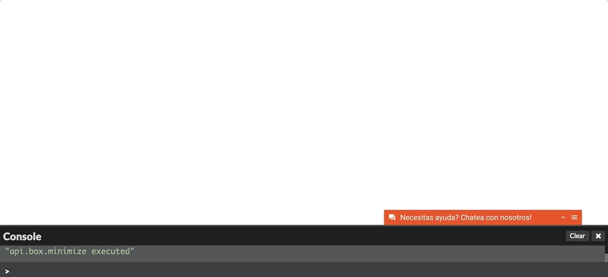

# Api Metodos Publicos

La api también permite controlar la visibilidad del chat y la escritura de mensajes internos, es decir, mensajes que son invisibles para el cliente. Esta funcionalidad es muy útil para registrar acciones relevantes automáticamente gatillados por eventos (ej: navegación, clicks, etc).

## window.$LT.setDisplayState([string])
*Los valores posibles que se pueden usar son: **hidden**, **minimized**, **small** *


**Hidden**

Oculta el box del chat sin destruir la sesión que tenga abierta.

*Ejemplo:*
```javascript
  window.$LT.setDisplayState('hidden');
```



**Minimized**

Pone box del chat en estado minificado, esto es cerrado pero visible.

*Ejemplo:*
```javascript
  window.$LT.setDisplayState('minimized');
```



**Small**

Pone box del chat en estado expandido, esto es abierto y visible.

*Ejemplo:*
```javascript
  window.$LT.setDisplayState('small');
```



## window.$LT.addChatMetaData([object])

*Ejemplo:*
```javascript
  window.$LT.addChatMetaData({
    empresa: window.location.href.match(/pyme/) ? 'pyme': 'no-pyme',
    usuarioPreferente: esPreferente()
  });
```

## window.$LT.addInternalSystemMessage([message])

*Ejemplo:*
```javascript
  window.$LT.addInternalSystemMessage('Ejemplo mensaje interno');
```

## window.$LT.startConversation([initialObject])

*Ejemplo:*
```javascript
  window.$LT.startConversation({
    inquiry: [inquiry_id],
  });
```

## window.$LT.logout()

*Ejemplo:*
```javascript
  window.$LT.logout();
```

## window.$LT.isAvailable()

**Atención este método no es recomendable y sera <span style="color:red">absoleto proximamente<span>.** Para chequear si el widget esta disponible se recomienda
el usa del evento *[api.events.availabe](apievents#apieventsavailable)*.

*Ejemplo:*
```javascript
  window.$LT.isAvailable();
```
